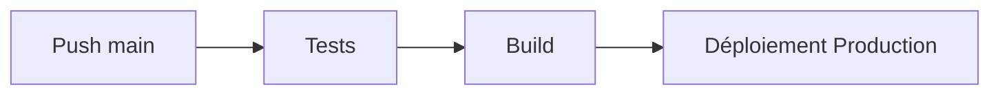
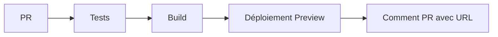

# CI/CD Railway - VetaVet

## Vue d'ensemble

Le système de CI/CD utilise GitHub Actions pour déployer automatiquement sur Railway.

## Configuration

### GitHub Actions
- **Trigger** : Push sur `main` et Pull Requests
- **Tests** : Lancement automatique des tests avant déploiement
- **Build** : Build automatique des applications
- **Déploiement** : Déploiement automatique sur Railway

### Railway
- **Builder** : Nixpacks (détection automatique)
- **Port** : 3000 (configuré via variable d'environnement)
- **Health Check** : `/api/health` pour l'API
- **Preview** : Déploiements temporaires pour les PRs

## Variables d'environnement requises

### GitHub Secrets
```bash
RAILWAY_TOKEN=your_railway_token
RAILWAY_PROJECT_ID=your_project_id
```

### Railway Environment Variables
```bash
NODE_ENV=production
PORT=3000
```

## Workflow de déploiement

### 1. Push sur main (Production)


### 2. Pull Request (Preview)


## Commandes de déploiement

### Déploiement local
```bash
# Installer Railway CLI
npm install -g @railway/cli

# Se connecter
railway login

# Déploiement
./scripts/deploy.sh
```

### Déploiement manuel
```bash
# Déployer l'API
cd apps/api && railway up

# Déployer le frontend
cd apps/web && railway up
```

## Endpoints de vérification

### Health Check
```bash
curl https://your-app.railway.app/api/health
```

### Réponse attendue
```json
{
  "status": "ok",
  "timestamp": "2024-01-01T00:00:00.000Z",
  "uptime": 123.456,
  "environment": "production"
}
```

## Monitoring

### Logs Railway
```bash
railway logs
```

### Status du service
```bash
railway status
```

### Variables d'environnement
```bash
railway variables
```

## Critères d'acceptation US-09

- [x] Déploiement via GitHub Actions
- [x] Preview pour chaque PR
- [x] Build + start commands configurés
- [x] PORT=3000 configuré
- [x] `/api/health` accessible
- [x] Tests automatiques avant déploiement
- [x] Documentation complète

## Troubleshooting

### Erreurs courantes

1. **Build échoue**
   - Vérifier les dépendances dans package.json
   - Vérifier la configuration nixpacks.toml

2. **Health check échoue**
   - Vérifier que l'API démarre correctement
   - Vérifier les variables d'environnement

3. **Port déjà utilisé**
   - Vérifier la variable PORT=3000
   - Vérifier qu'aucun autre service n'utilise le port

### Commandes de debug
```bash
# Vérifier les logs
railway logs --tail

# Redémarrer le service
railway service restart

# Vérifier la configuration
railway service show
```
